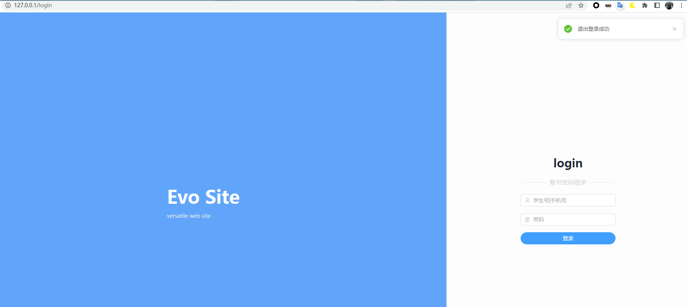
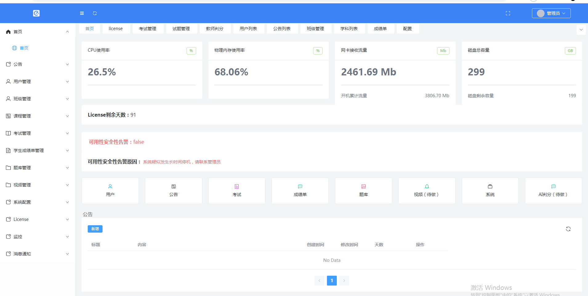

# evo site

author: senranja

# Technique

front: VUE + VUEX + ElementPlus

backend: Django + DRF

maintain: Docker + Nginx + docker-compose

# deploy

```shell
cd ./exam_system
docker-compose build
docker-compose up -d
```

# description

This is a simple exam system, which is mainly used for the examination nowadays. The system is divided into two parts: the front end and the back end. 

But once you understand the basic structure of the system, you can easily expand it to other fields, such as online testing, online voting, etc.

# site sample






