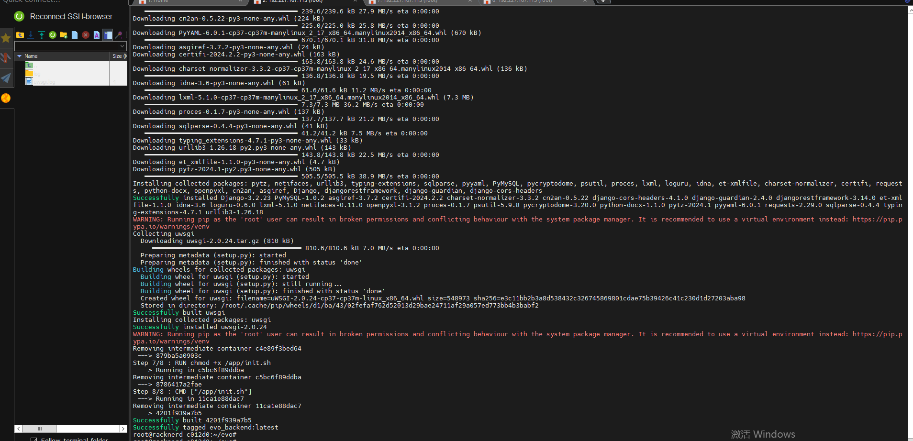

# evo site

author: senranja

# Technique

front: VUE + VUEX + ElementPlus

backend: Django + DRF

maintain: Docker + Nginx + docker-compose

# deploy

despite deploy's commands are very normal, but because I didnot handled the delay of the backend's container behand of the mysql, so follow the steps below to make sure some commands in backend's container could execute successfully.

```shell
cd ./exam_system
docker-compose build
docker-compose up -d
```

`docker-compose build`



`docker-compose up`

in this step, you can see something wrong of backend's output, because when the first time mysql need some time to init and start, so when display like below picture, then  Control-C finish.


`docker-compose up` again

This time you can see the correct mysql data migration and the admin and its default password generated in output.


remeber the password, then login your site, you can change the admin's password later.


ctrl-C  then `docker-compose up`

make your docker-compose run in daemon mode.

# description

This is a simple exam system, which is mainly used for the examination nowadays. The system is divided into two parts: the front end and the back end. 

But once you understand the basic structure of the system, you can easily expand it to other fields, such as online testing, online voting, etc.

# site sample


# todo

- [ ] cancel the license setting
- [ ] make the Docker extract the files more accurately